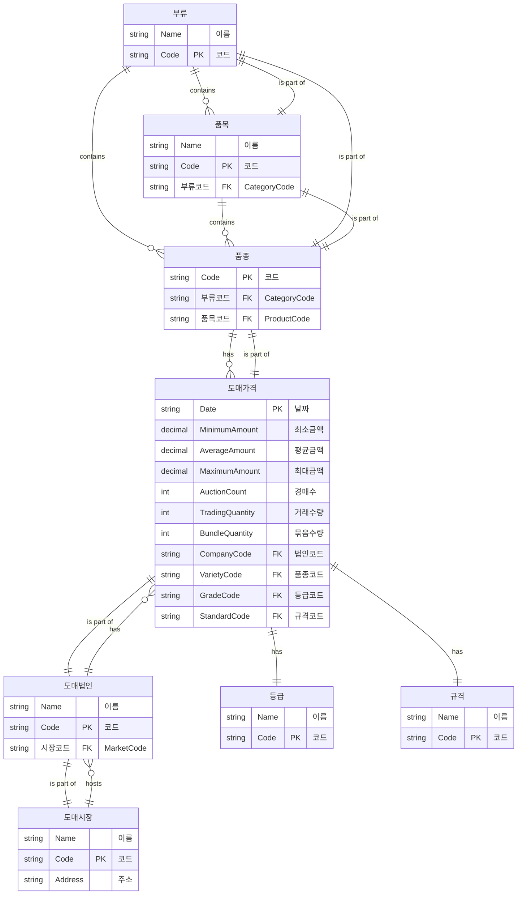

<h2 align="center"><strong>ER Diagram </strong></h2>

```mermaid
erDiagram
    "부류" ||--o{ "품목" : "contains"
    "부류" ||--o{ "품종" : "contains"
    "품목" ||--o{ "품종" : "contains"
    "품목" ||--|| "부류" : "is part of"
    "품종" ||--|| "부류" : "is part of"
    "품종" ||--|| "품목" : "is part of"
    "품종" ||--o{ "도매가격" : "has"
    "도매시장" ||--o{ "도매법인" : "hosts"
    "도매법인" ||--o{ "도매가격" : "has"
    "도매법인" ||--|| "도매시장" : "is part of"
    "도매가격" ||--|| "도매법인" : "is part of"
    "도매가격" ||--|| "품종" : "is part of"
    "도매가격" ||--|| "등급" : "has"
    "도매가격" ||--|| "규격" : "has"

    "부류" {
        string Name "이름"
        string Code PK "코드"
    }
    "품목" {
        string Name "이름"
        string Code PK "코드"
        string 부류코드 FK "CategoryCode"
    }
    "품종" {
        string Code PK "코드"
        string 부류코드 FK "CategoryCode"
        string 품목코드 FK "ProductCode"
    }
    "등급" {
        string Name "이름"
        string Code PK "코드"
    }
    "규격" {
        string Name "이름"
        string Code PK "코드"
    }
    "도매시장" {
        string Name "이름"
        string Code PK "코드"
        string Address "주소"
    }
    "도매법인" {
        string Name "이름"
        string Code PK "코드"
        string 시장코드 FK "MarketCode"
    }
    "도매가격" {
        string Date PK "날짜"
        decimal MinimumAmount "최소금액"
        decimal AverageAmount "평균금액"
        decimal MaximumAmount "최대금액"
        int AuctionCount "경매수"
        int TradingQuantity "거래수량"
        int BundleQuantity "묶음수량"
        string CompanyCode FK "법인코드"
        string VarietyCode FK "품종코드"
        string GradeCode FK "등급코드"
        string StandardCode FK "규격코드"
    }


```
